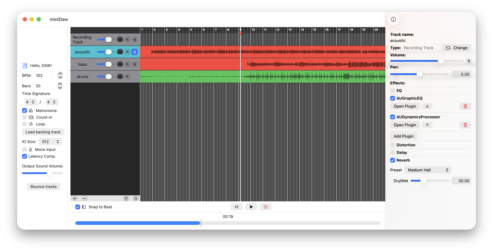

# miniDaw

An exercise in Swift, SwiftUI and audio processing - small Mac OS project for recording and playback of audio files using `AVAudioEngine` from `AVFoundation`.

You can also apply any custom Audio Plugins available on the system.

See the project presentation using a link below:

 
###### *Video Showcase*

This is a work-in-progress project
